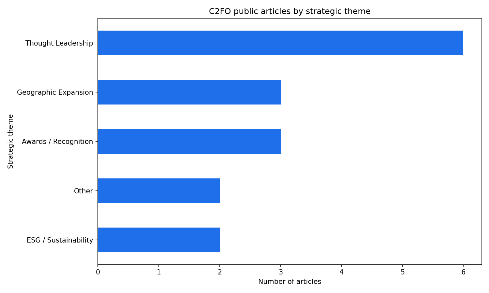

# C2FO Competitor Strategy Tracker

A Python-based competitive intelligence tool that scrapes C2FO's public newsroom and blog, classifies every article by strategic theme, and produces a structured dataset with supporting visualisations.

---

## The Business Question

**What is C2FO's public content strategy, and what does it reveal about their competitive positioning against SAP Taulia?**

In supply chain finance, the market narrative a competitor builds in public — through press releases, blog posts, and thought leadership — is a direct signal of where they are investing, which audiences they are courting, and which product gaps they are trying to paper over. A company that leads with ESG messaging is chasing a different buyer than one that leads with geographic expansion. A company that leans on awards coverage is signalling credibility concerns; one that leads with product launches is in acquisition mode.

This project operationalises that insight. By systematically categorising C2FO's published content into a strategic framework, it converts a competitor's PR activity into structured intelligence that Taulia can act on — informing positioning decisions, shaping the content calendar, and equipping the sales team with a sharper narrative for competitive displacement conversations.

---

## Methodology

- **Data collection:** The script scrapes C2FO's public newsroom (`c2fo.com/newsroom/`) and blog (`c2fo.com/blog/`) using Python, `requests`, and `BeautifulSoup`. It walks pagination automatically and enriches each article by reading its individual page for the publication date and meta description.

- **Classification framework:** Each article is classified into one of six strategic themes — **Product Launch, Partnership, Geographic Expansion, Thought Leadership, ESG / Sustainability,** and **Awards / Recognition** — using a keyword dictionary with word-boundary matching. These themes were chosen deliberately to map to the strategic priorities a supply chain finance buyer or analyst would care about, not to generic content categories.

- **Structured output:** Results are written to a CSV (`c2fo_strategy_data.csv`) containing source, title, date, URL, description, and theme for every article — a clean dataset ready for further analysis or integration into a broader competitive intelligence workflow.

- **Visualisation:** Two charts are generated using `Pandas` and `Matplotlib`: a theme breakdown bar chart showing the distribution of strategic focus, and a monthly timeline chart showing publishing cadence over time.

- **Tooling:** Python 3 · Pandas · BeautifulSoup4 · Matplotlib · Requests. No paid APIs, no headless browsers — the approach is transparent, reproducible, and runs end-to-end in under 30 seconds.

---

## Key Findings

Across 16 articles published between January 2025 and April 2026, **Thought Leadership is C2FO's dominant communication theme**, accounting for 38% of all content — nearly double the next two categories combined.

| Theme | Articles |
|---|---|
| Thought Leadership | 6 |
| Awards / Recognition | 3 |
| Geographic Expansion | 3 |
| ESG / Sustainability | 2 |
| Other | 2 |

The data tells a clear story: C2FO is investing heavily in narrative authority — positioning its executives and brand as voices of record on supply chain finance trends — rather than leading with product announcements or partnership wins. The absence of Product Launch coverage in the dataset is notable; it suggests either a mature product with incremental updates, or a deliberate decision to downplay product differentiation in favour of category ownership.

The combination of Thought Leadership dominance and a significant Awards / Recognition presence points to a company in trust-building mode — likely targeting CFOs and procurement leaders who are still evaluating the category, not just switching vendors.

**For Taulia:** C2FO's content gap in Partnership and Product Launch coverage is a direct opening. A Taulia content strategy that leads with integration depth, ecosystem partnerships, and concrete product capabilities would occupy ground C2FO is currently leaving uncontested.
